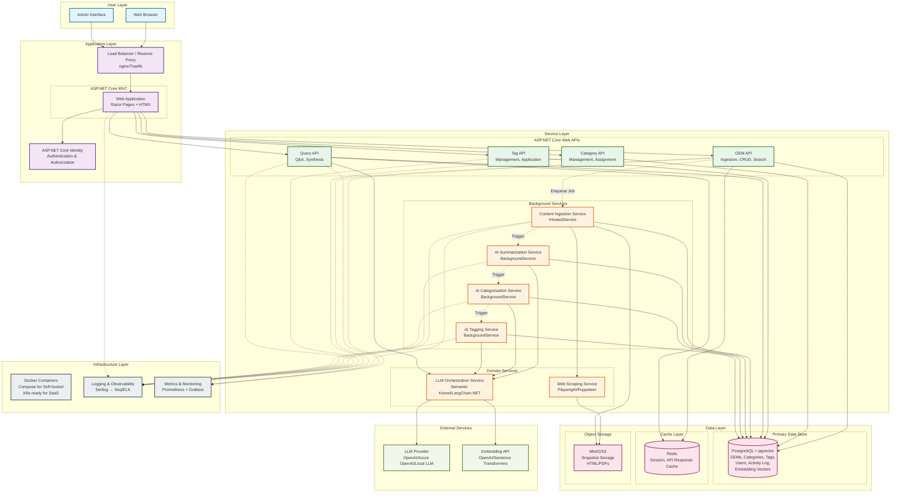

# Epic Architecture Specification: GEM Ingestion, Summarization, and Smart Categorization

## 1. Epic Architecture Overview

This epic establishes the foundational architecture for the InfoDumpManager system, focusing on intelligent knowledge capture and organization. The architecture follows domain-driven design principles with a modular monolith approach, containerized via Docker for both self-hosted and future SaaS deployment paths.

The system centers on a **GEM (Generated Enriched Memory) Domain** that handles content ingestion, AI-powered summarization, and intelligent categorization with tagging. The architecture employs ASP.NET Core Web APIs for synchronous operations, background services for asynchronous AI processing, and integrates with external LLM providers and web scraping services.

Key architectural patterns:
- **Domain-driven layered architecture** with clear separation between Web UI, API, Application Services, Domain, and Infrastructure layers
- **CQRS-lite pattern** for read/write separation where GEM queries differ significantly from mutations
- **Event-driven background processing** for AI operations to maintain responsive user experience
- **Repository and Unit of Work patterns** for data access abstraction
- **Strongly-typed API clients** for type-safe service communication

The system is designed with **multi-tenancy awareness** from the start (even if initially single-user), ensuring smooth migration to SaaS without architectural rework.

---

## 2. System Architecture Diagram

---

## 3. High-Level Features & Technical Enablers

### High-Level Features

#### F1: Web Content Ingestion
- Accept URL submission via Web UI
- Fetch and render web page content using headless browser
- Extract title, metadata, and clean HTML
- Store original snapshot (HTML) in object storage
- Create GEM entity with source link and snapshot reference

#### F2: AI-Powered Summarization
- Generate concise summaries from ingested content
- Link summaries to source GEMs
- Support summary regeneration/refinement
- Track summary quality metrics

#### F3: Intelligent Auto-Categorization
- Analyze GEM content and existing category structure
- Suggest existing category or propose new category name
- Allow user confirmation or manual override
- Track categorization accuracy for model improvement

#### F4: AI Tag Suggestion & Management
- Generate relevant tags for GEMs at ingestion time
- Support both intra-category (sub-division) and cross-category (linking) tags
- Enable manual tag creation, renaming, deletion
- Apply/remove tags from GEMs manually

#### F5: Category Management
- Create, rename, merge, and delete categories
- Reassign GEMs between categories
- Bulk operations with safety confirmations
- Category hierarchy (future consideration, design for extensibility)

#### F6: GEM Discovery & Search
- Full-text search across GEM titles and summaries
- Filter by category, tags, date range, source type
- Semantic search using vector embeddings
- Sort by relevance, date, or custom criteria

#### F7: Category-Level Synthesis & Q&A
- Generate on-demand category summaries
- Answer user questions grounded in category GEMs
- Cite source GEMs in responses
- Track query helpfulness (thumbs up/down)

#### F8: Activity Logging & Audit Trail
- Log GEM creation, updates, deletions
- Track AI operations (summarization, categorization, tagging)
- Record user actions (category changes, tag applications)
- Provide audit trail for compliance and debugging

### Technical Enablers

#### TE1: Domain Model & Data Schema
- **GEM Aggregate:** Core entity with value objects for Source, Snapshot, Summary
- **Category Aggregate:** With GEM assignments and metadata
- **Tag Entity:** Many-to-many relationship with GEMs
- **User Entity:** ASP.NET Core Identity integration
- **ActivityLog Entity:** Event sourcing pattern for audit trail
- PostgreSQL schema with proper indexing for search and filtering
- Entity Framework Core mappings and configurations

#### TE2: Background Job Processing Infrastructure
- Job queue mechanism (in-memory for self-hosted, can scale to RabbitMQ/Azure Service Bus)
- IHostedService implementations for long-running background workers
- Retry policies and dead-letter handling
- Job status tracking and visibility

#### TE3: LLM Integration Layer
- Abstraction over LLM providers (OpenAI, Azure OpenAI, local models)
- Prompt management and versioning
- Token usage tracking and cost monitoring
- Rate limiting and circuit breaker patterns
- Caching for repeated queries

#### TE4: Vector Database Integration
- pgvector extension for PostgreSQL
- Embedding generation pipeline (text → vector)
- Vector columns in GEM and summary tables
- Hybrid search combining PostgreSQL full-text search and pgvector similarity search
- Index optimization for vector operations (HNSW or IVFFlat)

#### TE5: Web Scraping Service
- Playwright or Puppeteer.Sharp integration
- User-agent rotation and request throttling
- Content extraction and cleaning (Readability.NET or similar)
- Screenshot capture capability
- Retry logic for failed fetches

#### TE6: Object Storage Service
- MinIO client for S3-compatible storage
- Snapshot versioning strategy
- Retention policies and lifecycle management
- Pre-signed URL generation for secure access

#### TE7: API Client Generation
- NSwag or Swashbuckle for OpenAPI spec generation
- Strongly-typed C# client library for internal service communication
- Versioning strategy (URI versioning: /api/v1/...)

#### TE8: Authentication & Authorization Infrastructure
- ASP.NET Core Identity for user management
- JWT bearer token authentication for API access
- Claims-based authorization
- Multi-tenancy support (TenantId claims, row-level security)

#### TE9: Observability Stack
- Serilog with structured logging
- Seq or ELK stack for log aggregation
- Prometheus metrics exporters
- Grafana dashboards for KPIs
- Application Insights or OpenTelemetry for distributed tracing

#### TE10: Caching Strategy
- Redis distributed cache
- Response caching middleware for APIs
- Memory cache for frequently accessed data
- Cache invalidation patterns

---

## 4. Technology Stack

### Backend Framework
- **.NET 8.0** (LTS) - Primary framework
- **ASP.NET Core 8.0** - Web applications and APIs
- **C# 12** - Programming language

### Web & API Layer
- **ASP.NET Core Razor Pages** - Server-rendered Web UI with HTMX for interactivity
- **ASP.NET Core Web API** - RESTful APIs
- **ASP.NET Core Identity** - Authentication and user management
- **NSwag / Swashbuckle** - OpenAPI/Swagger documentation and client generation

### Domain & Application Layer
- **MediatR** - CQRS pattern implementation
- **FluentValidation** - Input validation
- **AutoMapper** - Object-to-object mapping
- **Polly** - Resilience and transient fault handling

### Data Access
- **Entity Framework Core 8.0** - Primary ORM for PostgreSQL
- **PostgreSQL 16** - Primary relational database with pgvector extension
- **Npgsql** - PostgreSQL .NET driver
- **pgvector** - Vector similarity search extension for PostgreSQL
- **Dapper** (optional) - Micro-ORM for performance-critical queries in future optimization phases

### AI & Machine Learning
- **LangChain.NET** - LLM orchestration
- **Azure.AI.OpenAI** / **OpenAI SDK** - LLM provider integration
- **Pgvector.EntityFrameworkCore** - Entity Framework Core support for pgvector
- **Microsoft.ML.Tokenizers** - Text tokenization

### Background Processing
- **IHostedService / BackgroundService** - Built-in .NET background jobs
- **Hangfire** (optional) - Advanced job scheduling and dashboard
- **System.Threading.Channels** - Producer-consumer patterns

### Web Scraping & Content Extraction
- **Playwright** or **PuppeteerSharp** - Headless browser automation
- **HtmlAgilityPack** - HTML parsing
- **SmartReader** - Article content extraction

### Caching & Performance
- **StackExchange.Redis** - Redis client
- **Microsoft.Extensions.Caching.Memory** - In-memory caching
- **Microsoft.Extensions.Caching.Distributed** - Distributed caching abstractions

### Object Storage
- **Minio.AspNetCore** - S3-compatible object storage client
- **Azure.Storage.Blobs** (optional for Azure deployments)

### Observability
- **Serilog** - Structured logging
- **Serilog.Sinks.Seq** - Log aggregation
- **Serilog.Sinks.Console / File** - Development logging
- **prometheus-net** - Metrics collection
- **OpenTelemetry** - Distributed tracing
- **Application Insights SDK** (optional for Azure)

### Testing
- **xUnit** - Unit and integration testing framework
- **FluentAssertions** - Assertion library
- **Moq** - Mocking framework
- **Testcontainers** - Integration testing with containers
- **Bogus** - Test data generation

### Containerization & Deployment
- **Docker** - Containerization
- **Docker Compose** - Multi-container orchestration (self-hosted)
- **nginx** or **Traefik** - Reverse proxy and load balancing

### Frontend (if applicable)
- **Razor Pages + HTMX** - Server-rendered UI with lightweight interactivity
- **Tailwind CSS** - Utility-first CSS framework
- **Alpine.js** - Lightweight JavaScript for client-side interactivity (form validation, debouncing, etc.)

---

## 5. Technical Value

**Value: High**

### Justification:

1. **Reusable AI Integration Patterns:** Establishing LLM orchestration, prompt management, and vector search patterns creates reusable infrastructure for future AI-powered features beyond this epic.

2. **Scalable Multi-Tenant Foundation:** Designing with multi-tenancy from the start (even for single-user self-hosted) eliminates costly refactoring when transitioning to SaaS. The architecture supports both deployment models without code forks.

3. **Domain-Driven Modularity:** Clean separation of concerns and domain-driven design enables parallel development, easier testing, and future feature additions without architectural debt.

4. **Background Processing Infrastructure:** The async job processing system established here becomes the backbone for all future long-running operations (bulk imports, scheduled reports, etc.).

5. **Observability First:** Built-in logging, metrics, and tracing from day one reduces debugging time, enables data-driven optimization, and ensures production readiness.

6. **Technology Alignment:** Leveraging .NET 8 LTS ensures long-term support (until November 2026 + 3 years) and access to latest performance improvements and security updates.

7. **Extensibility Hooks:** The architecture explicitly designs for future source types (email, PDF, RSS) without requiring rework of the core ingestion pipeline.

### Risk Mitigation:
- **LLM Provider Lock-in:** Abstraction layer allows switching providers
- **Scaling Constraints:** Architecture supports both monolith (self-hosted) and distributed (SaaS) deployment
- **Data Privacy:** Self-hosted deployment option addresses privacy concerns while maintaining SaaS path

---

## 6. T-Shirt Size Estimate

**Size: L (Large)**

### Breakdown Rationale:

This epic represents foundational architecture work with multiple complex integrations:

- **Medium Complexity (3-4 weeks):**
  - Domain model and data schema design
  - Basic CRUD APIs for GEMs, Categories, Tags
  - Web UI for GEM display and category management
  - PostgreSQL setup and Entity Framework Core configuration

- **High Complexity (4-5 weeks):**
  - LLM integration layer with prompt engineering
  - Background job processing infrastructure
  - Web scraping service with headless browser
  - Vector database integration and semantic search
  - AI summarization, categorization, and tagging pipelines

- **Medium Complexity (2-3 weeks):**
  - Object storage integration for snapshots
  - Redis caching layer
  - Activity logging and audit trail
  - Search and filtering implementation

- **Cross-Cutting (2-3 weeks):**
  - Authentication and authorization setup
  - Docker containerization and compose orchestration
  - Observability stack (logging, metrics, dashboards)
  - API documentation and strongly-typed clients
  - Testing infrastructure (unit, integration tests)

- **Contingency (2 weeks):**
  - LLM prompt tuning for quality results
  - Performance optimization
  - Bug fixes and edge case handling

**Total Estimated Effort:** 13-17 weeks of focused development work

**Implementation Strategy:**
- **Phase 1-3:** Use Entity Framework Core exclusively for all data access
- **Phase 4 (Polish):** Profile query performance; introduce Dapper for high-latency search/retrieval paths only if needed

**Assumptions:**
- Team of 2-3 developers working in parallel
- Experienced with .NET ecosystem and AI integrations
- Infrastructure (PostgreSQL with pgvector, Redis) can be containerized quickly
- Access to LLM API (OpenAI or Azure OpenAI) for development

**Dependencies:**
- LLM API access and API keys
- Infrastructure setup for development/staging environments
- Design mockups for Web UI (not blocking if iterative approach)

**Delivery Phases:**
1. **Phase 1 (4-5 weeks):** Core domain, basic ingestion, manual categorization
2. **Phase 2 (4-5 weeks):** AI summarization and auto-categorization
3. **Phase 3 (3-4 weeks):** Tagging, search, Q&A synthesis
4. **Phase 4 (2-3 weeks):** Polish, observability, production readiness
